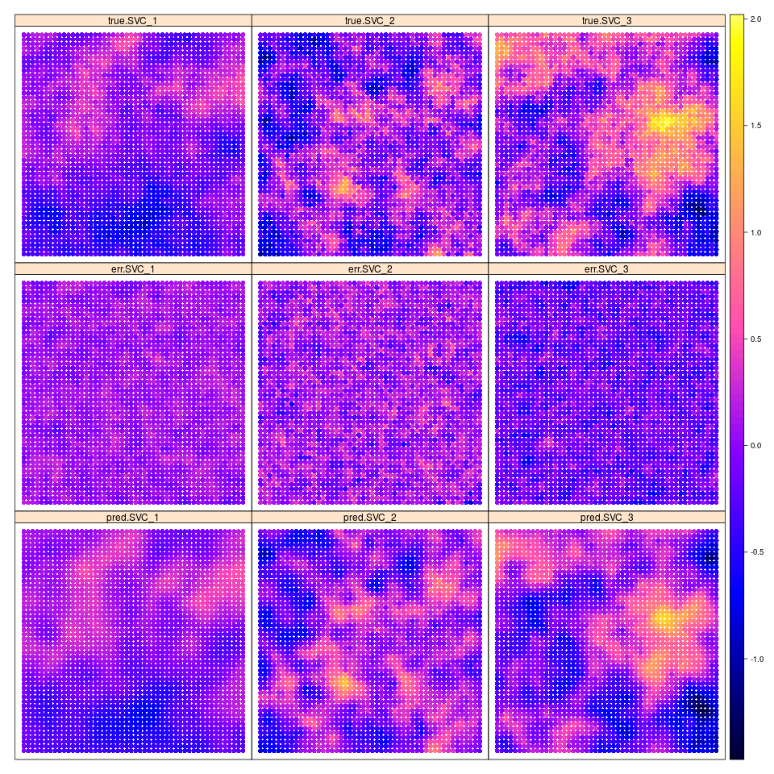

```{r setup, include=FALSE}
rm(list = ls())
knitr::opts_chunk$set(echo = TRUE)
library(varycoef)
```

## Introduction

The package `varycoef` contains methods to model and estimate varying coefficients. In its current version `r packageVersion("varycoef")` it supports:

- only *spatially* varying coefficient (SVC)

- different MLE approaches to model SVC and to give predictions. 


### Spatially Varying Coefficient Models

We define a *full SVC model* as


$$y(s) = x^{(1)}(s)\beta_1(s) + ... + x^{(p)}(s)\beta_p(s) + \epsilon(s)$$

with the coefficients represented by Gaussian random fields (GRF) $\beta_j(\cdot) \sim \mathcal N (\mu_j \textbf 1_n, C_j(\cdot, \cdot))$. That is, every coefficient $j = 1, ..., p$ is distinctly defined by a mean $\mu_j$ and a covariance matrix defined by an underlying covariance function $C_j(s_k, s_l) = \sigma_j^2 \phi_{\rho_j}(s_k, s_l)$, where $\sigma_k^2$ is the variance and $\rho_j$ is the scale of the GRF. Further, $\epsilon$ is a nugget effect with variance $\tau^2$. 

However, there are some cases, where the assumption of a full SVC model is not applicable. We want to give options for covariates w.r.t.:

1. *mixed SVC*, i.e. as above with its respective mean (fixed effect) and random effect described by its GRF.
2. *fixed effect*, i.e. without an GRF modelling its spatial structure.
3. *mean-zero SVC*, i.e. only a zero-mean random effect modelling the spatial structure. 

That is why we generalize the model above. First, note that we can write it in matrix form as

$$\textbf y(\textbf s) = \textbf X  \beta(\textbf s) + \epsilon( \textbf s)$$

where $\textbf X$ is our model matrix. Then we can write down the model divided into an fixed effect part and a random effect part:


$$\textbf y(\textbf s) = \textbf X  \mu + \textbf W  \eta(\textbf s) + \epsilon( \textbf s)$$

where $\eta$ is the joint mean-zero GRF. Note that both model are the same if $\textbf X  = \textbf W$. Thus, we can specify options 1 to 3 from above by in- or excluding columns of $\textbf X$ or $\textbf W$, respectively.


### Example


To give a simple example, we start by sampling artificial data. So define an *full SVC model* as given above and sample from a regular grid using a help function:


```{r define and sample SVC, warning=FALSE, fig.width=7, fig.height=7, message=FALSE}
# number of SVC
p <- 3

(pars <- data.frame(mu = rep(0, p), 
                    var = c(0.1, 0.2, 0.3), 
                    scale = c(0.3, 0.1, 0.2)))
nugget.var <- 0.05

# sqrt of total number of observations

m <- 20


library(RandomFields)
library(sp)

sp.SVC <- varycoef:::fullSVC_reggrid(m = m, p = p, 
                                     pars = list(pars = pars, 
                                                 nugget.var = nugget.var))

spplot(sp.SVC, colorkey = TRUE)
```


We further need some covariates which we sample from a standard normal. In order to model an intercept, we set $x^{(1)} = 1$:

```{r sample covariates}
n <- m^2

X <- matrix(c(rep(1, n), rnorm((p-1)*n)), ncol = p)
head(X)
```

We compute the response $y$:

```{r compute response}
y <- apply(X * as.matrix(sp.SVC@data[, 1:p]), 1, sum) + sp.SVC@data[, p+1]
```


## MLE in `varycoef`


The main function of this package is `SVC_mle`. Its function call starts the MLE but it requires some preparation and settings of control parameters. We go through each argument of the `SVC_mle` function and its control parameter `SVC_mle.control`. 

### The Function `SVC_mle`

As one might see in the help file of the `SVC_mle` function, it has 3 mandatory arguments: `y`, the response; `X`, the data matrix and `locs`, the locations. If we do not change `W`, i.e. `W = NULL`, then we use `W = X` and are in the case of a full SVC. We will give examples for different kinds of models. 

### Control Parameters

As for the control parameters for `SVC_mle`, we go through them as they are implemented in the current version of `varycoef`. By calling `SVC_mle_control`, we create an list with all needed arguments to start a simple `SVC_mle`. 


```{r contorl parameters}
control <- SVC_mle_control()
str(control)
```

#### Covariance Function

Here we define the covariance function $C_j(s_k, s_l) = \sigma_j^2 \phi_{\rho_j}(s_k, s_l)$. In its current version `r packageVersion("varycoef")`, `varycoef` supports only exponential covariance functions, i.e. $\phi_{\rho}(s_k, s_l) = \exp\left(\frac{\|s_k - s_l\|}{\rho}\right)$.


#### Tapering

Covariance tapering goes back to FURRER and is a technique to challenge the "big $n$ problem" when dealing with spatial data. When working with $n$ observations, the covariance matrix has dimension $n \times n$. The likelihood function of a single GRF or, in particular, the SVC models as described above, includes the inverse as well as the determinant of a covariance matrix. The computation of both is based on the Cholesky decomposition which has run-time $\mathcal O(n^3)$. There are several ways on how to deal with this computational burden. 

With *covariance tapering*, we introduce a sparsity structure on the covariance matrix. This sparsity structure can then be used to our advantage with the Cholesky decomposition implemented in the package `spam`. In a nutshell, this decomposition becomes faster as the sparsity increases. However, this comes with a trade-off in the precision of the MLE of the covariance parameters with finitely many observation. Asymptotically, the procedure is consistent. 


By default, the `tapering` entry is `NULL`, i.e. no tapering is applied. If a scalar is provided, then this is taper range is applies. In other words, every spatial dependency is cut for distances larger than `tapering`. We illustrate the difference between both the untapered and tapered covariance matrix of the SVC on the regular grid example from above. 


```{r illustrate tapering, echo = FALSE, fig.width=7, fig.height=7}

r <- c(0.5, 0.3, 0.1)
out <- lapply(c(list(NULL), as.list(r)), function(taper.range) {
  
  
  locs <- coordinates(sp.SVC)
  if (is.null(taper.range)) {
    d <- as.matrix(dist(locs))
  } else {
    d <- spam::nearest.dist(locs, delta = taper.range)
  }
  
  
  # get covariance function
  raw.cov.func <- varycoef:::MLE.cov.func("exp")
  
  # covariance function
  cov.func <- function(x) raw.cov.func(d, x)
    
  
  W <- X
  
  outer.W <- lapply(1:p, function(j) W[, j]%o%W[, j])
  
  
  # tapering?
  taper <- if(is.null(taper.range)) {
    # without tapering
    NULL
  } else {
    # with tapering
    spam::cov.wend1(d, c(taper.range, 1, 0))
  }
  
  x <- c(rep(1, 2*p+1), rep(0, p))
  
  S_y <- varycoef:::Sigma_y(x, p, cov.func, outer.W, taper)
  
  nll <- function() varycoef:::n2LL(x, cov.func, outer.W, y, X, W, taper = taper)
  
  list(d, taper, S_y, nll)
})


par(mfrow = c(2, 2))


image(out[[1]][[3]])
title(main = "No tapering applied")
image(out[[2]][[3]])
title(main = paste0("Taper range = ", r[1]))
image(out[[3]][[3]])
title(main = paste0("Taper range = ", r[2]))
image(out[[4]][[3]])
title(main = paste0("Taper range = ", r[3]))


par(mfrow = c(1, 1))

```


Finally, we show the time differences of evaluating the likelihood function between the different taper ranges. We use the `microbenchmark` package:   

```{r runtime tapering, fig.width=7, echo = TRUE, fig.height=5, warning=FALSE}


library(microbenchmark)

(mb <- microbenchmark(no_tapering  = out[[1]][[4]](),
                      tapering_0.5 = out[[2]][[4]](), 
                      tapering_0.3 = out[[3]][[4]](),
                      tapering_0.1 = out[[4]][[4]]())
)

boxplot(mb, unit = "ms", log = TRUE, xlab = "tapering", ylab = "time (milliseconds)")
```


#### Parallelization of Optimization

To be implemented.


#### Initial Values

To run an MLE, we need initial values for all variances and the scales as well as the means. A good starting point for the means are the estimated coefficients of an OLS, i.e.:

```{r mean initials}
(mu.init <- coef(lm(y~.-1, data = data.frame(y = y, X = X))))
```


For the variance, we take the estimated variance of the OLS method, i.e 

```{r variance initials}
(var.init <- sigma(lm(y~.-1, data = data.frame(y = y, X = X)))^2)
```

For the scale, we remind ourselves that the effective range of an exponential GRF is approximately 3 times its range. Since in our case we are in an restricted domain of the unit square, any dependency structure on a distance above the maximum distance in the domain, we cannot not model. Therefore we suggest to take an initial scale of 


```{r scale initials}
scale.init <- 0.2
```


The vector of initial values is then:


```{r joint initials}
init <- c(rep(c(scale.init, var.init), p), # GRFs scales and variances
          var.init,                        # nugget variance
          mu.init)                         # means
```


One can either overwrite the default initial value (`control$init`) or call `SVC_mle_control` with corresponding arguments:

```{r overwrite initials}
# default
control$init

# overwrite
control$init <- init

# create new
control <- SVC_mle_control(init = init)
```

**The default values gives initial values of $0.3$ for the variances and ranges and $0$ for the means, which might not be the best option in general.**


#### Lower and Upper Bounds

The optimization function `optim` allows with its chosen method `"L-BFGS-B"` the usage of lower and upper bounds. The lower and upper bounds for each parameter can be given in correspondence to the order in the initial values.


#### Save Fitted Values

The argument `save.fitted` takes logical values and decides whether the fitted values of the SVC model after the MLE should be computed. This takes some extra time, but can be useful since an extraction of those fitted values as well as the residuals is possible using a methods `fitted` or `residuals`. 

```{r overwrite save.fitted}
# default
control$save.fitted

# overwrite
control$save.fitted <- TRUE
```

#### Profile Likelihood

In some SVC models, it might be an advantage to optimize not over all parameters, i.e. the mean and the covariance parameters. The motivation here is a dimension reduction of the parameter space. Setting `profileLik` to `TRUE`, the optimization will be done using the profile Likelihood of the covariance parameters. The mean effects are then implicitly calculated using the *generalized least squares estimate*. 

```{r show profileLik}
# default
control$profileLik
```

**Attention:** Since the number of parameters is reduced, one should also be aware that the initial values as well as the lower and upper bounds are given correctly. 


#### Regularizing Priors

We implemented a usage of penalizing complexity priors. The argument `pc.prior` takes a vector of length 4 as an input where the values are $\rho_0, \alpha_\rho, \sigma_0, \alpha_\sigma$ to compute penalized complexity priors. One wants to penalize the lower tail on the range parameter as well as the upper tail of the standard deviation:

$$P(\rho < \rho_0) = \alpha_\rho, \quad P(\sigma > \sigma_0) = \alpha_\sigma.$$

### Example: MLE of full SVC 

We can now start the MLE.


```{r SVC MLE}
fit <- SVC_mle(y = y, X = X, locs = coordinates(sp.SVC), control = control)

class(fit)

# estimated parameters
cov_par(fit) # covariance parameters
coef(fit)    # mean effects
```


Now, we can use our `fit` object to make predictions:


```{r make predictions}
# calling predictions without specifying new locations (newlocs) or 
# new covariates (newX) gives estimates of SVC only at the training locations.
pred.SVC <- predict(fit)
```


Since we know the true SVC, we can compute the error in prediction and compare it to the true values.

```{r visualization of prediction, fig.width=7, fig.height=7}
colnames(pred.SVC)[1:p] <- paste0("pred.",colnames(pred.SVC)[1:p])
coordinates(pred.SVC) <- ~loc_x+loc_y
all.SVC <- cbind(pred.SVC, sp.SVC[, 1:3])

# compute errors
all.SVC$err.SVC_1 <- all.SVC$pred.SVC_1 - all.SVC$SVC_1
all.SVC$err.SVC_2 <- all.SVC$pred.SVC_2 - all.SVC$SVC_2
all.SVC$err.SVC_3 <- all.SVC$pred.SVC_3 - all.SVC$SVC_3

colnames(all.SVC@data) <- paste0(rep(c("pred.", "true.", "err."), each = p), "SVC_", rep(1:p, 3))

spplot(all.SVC[, paste0(rep(c("true.", "err.", "pred."), each = p), 
                        "SVC_", 1:p)], colorkey = TRUE)
```


In this small example we already can see that the predicted SVC takes the general spatial structure of the true SVC. The error does not appear to have spatial structure for the SVC 2 and 3, respectively. However, the error for the intercept seems to have some spatial structure. If we increase the number of observations, the picture changes:


```{r n2500 figure, fig.width=7, fig.height=7}

```


We do not run the code since it takes a couple hours to do the MLE, but here is the code to reproduce the figure:

```{r n2500 example, eval=FALSE}
# new m
m <- 50

# new SVC model
sp.SVC <- varycoef:::fullSVC_reggrid(m = m, p = p, 
                                     pars = list(pars = pars,
                                                 nugget.var = nugget.var))
spplot(sp.SVC, colorkey = TRUE)

# total number of observations
n <- m^2
X <- matrix(c(rep(1, n), rnorm((p-1)*n)), ncol = p)
y <- apply(X * as.matrix(sp.SVC@data[, 1:p]), 1, sum) + sp.SVC@data[, p+1]


fit <- SVC_mle(y = y, X = X, locs = coordinates(sp.SVC))


sp2500 <- predict(fit)


colnames(sp2500)[1:p] <- paste0("pred.",colnames(sp2500)[1:p])
coordinates(sp2500) <- ~loc_x+loc_y
all.SVC <- cbind(sp2500, sp.SVC[, 1:3])

# compute errors
all.SVC$err.SVC_1 <- all.SVC$pred.SVC_1 - all.SVC$SVC_1
all.SVC$err.SVC_2 <- all.SVC$pred.SVC_2 - all.SVC$SVC_2
all.SVC$err.SVC_3 <- all.SVC$pred.SVC_3 - all.SVC$SVC_3

colnames(all.SVC@data) <- paste0(rep(c("pred.", "true.", "err."), each = p), "SVC_", rep(1:p, 3))

png(filename = "figures/SVCs_result_n2500_p3.png")
spplot(all.SVC[, paste0(rep(c("true.", "err.", "pred."), each = p), 
                        "SVC_", 1:p)], colorkey = TRUE, 
       as.table = TRUE, layout = c(3, 3))
dev.off()
```


### Example: MLE of mixed SVC

In the case of an mixed SVC, i.e. when $\textbf X \neq \textbf W$, we need to specify the `W` argument of `SVC_mle` independently of `X`. We now have to differentiate between `X` and `W`, which is why we introduce `pX` and `pW` as the number of covariates for `X` and `W`, respectively. 


```{r sample SVC model}
# new m
m <- 20

# number of fixed effects
pX <- 4
# number of mean-zero SVC
pW <- 3


# mean values
mu <- 1:pX

# new SVC model
sp.SVC <- varycoef:::fullSVC_reggrid(m = m, p = pW, 
                                     pars = list(pars = pars,
                                                 nugget.var = nugget.var), 
                                     seed = 4)

# total number of observations
n <- m^2
X <- matrix(c(rep(1, n), rnorm((pX-1)*n, 
                               mean = rep(1:(pX-1), each = n), 
                               sd = rep(0.2*(1:(pX-1)), each = n))), ncol = pX)
W <- X[, 1:pW]
# calculate y 
y <- 
  # X * mu
  X %*% mu +
  # W * beta_tilde
  apply(W * as.matrix(sp.SVC@data[, 1:pW]), 1, sum) + 
  # nugget
  sp.SVC@data[, pW+1]

# new initial values
control <- SVC_mle_control(init = c(init[1:(2*pW + 1)], mu))

# MLE
fit <- SVC_mle(y = y, X = X, W = W, locs = coordinates(sp.SVC), control = control)

```

As above, one can then use the `SVC_mle`-class object to get predictions using a method of the `predict` function. Depending on the available information, there are 2 types of preditions one can receive. First, just specifying the new locations using `newlocs` will result in predictions for each individual SVC at corresponding locations. Additionally, when providing the corresponding data matrices `newX` **and** `newW` one gets the estiamted response variable `y`. Further, setting the argument `compute.y.var` to `TRUE` will give the predictive variances to the predictions of `y`.


```{r give predictions}
set.seed(5)
newlocs <- matrix(c(0, 0), ncol = 2)


# only SVC prediction without y prediction
(pred.SVC <- predict(fit, newlocs = newlocs))


# SVC prediction and y prediction (with predictive variance)
newX <- matrix(c(1, rnorm(pX-1)), ncol = pX)
newW <- matrix(newX[, 1:pW], ncol = pW)

(pred.SVC <- predict(fit, 
                     newlocs = newlocs, 
                     newX = newX, newW = newW, 
                     compute.y.var = TRUE))
```


